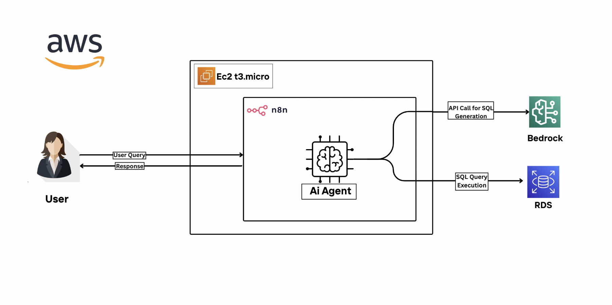

## Details:

1. In this exercise, we will create a serverless AI-powered database management agent using n8n hosted on an AWS EC2 instance, integrated with Amazon Bedrock (Nova Lite model) and an RDS PostgreSQL database. 

    The workflow uses n8n nodes to trigger on chat messages, process queries with Bedrock, execute SQL queries on RDS, and maintain conversation memory.
    
    A frontend chat interface in n8n allows user interaction.

2. AWS Region: US East (N. Virginia) us-east-1 (ensure Bedrock model availability)

## Introduction:

### Amazon Bedrock
• **Amazon Bedrock** is a fully managed service that simplifies building and scaling generative AI applications using foundation models from leading providers. It offers access to pre-trained models like Amazon Nova Lite via simple APIs, eliminating infrastructure management. This enables rapid integration of AI capabilities into applications like the n8n workflow for processing database queries.

### AWS RDS (PostgreSQL)
• **Amazon RDS (Relational Database Service)** provides managed PostgreSQL databases, handling setup, scaling, backups, and maintenance. In this exercise, RDS hosts the database for the AI agent to execute SQL queries generated by Bedrock.

### n8n
• **n8n** is an open-source workflow automation tool that enables building complex workflows through a visual interface. It supports integrations with AWS services and custom nodes for AI agents, making it ideal for orchestrating chat triggers, AI processing, and database operations.

### Lab Feature:
• This exercise lab focuses on building an AI-powered database management agent using n8n, Bedrock, RDS, and EC2. we will deploy an EC2 instance with n8n, configure an RDS PostgreSQL database, and set up an n8n workflow to process user queries via a chat interface, leveraging Bedrock's Nova Lite model for SQL generation and conversation handling.

### Benefits:
• **Amazon Bedrock AI Integration**: Learn to use Bedrock's Nova Lite model to generate SQL queries dynamically based on user input.

• **n8n Workflow Automation**:** Gain experience creating workflows with n8n nodes for chat triggers, AI processing, memory buffering, and database operations.

• **RDS PostgreSQL Management**: Understand how to set up and connect a managed PostgreSQL database for secure query execution.

• **EC2 Deployment**: Discover how to deploy n8n on an EC2 instance using Docker for scalable workflow hosting.

 

<h1 align="center">📝 Architecture Diagram </h1>

  

---

### Task Details:

1. Sign in to AWS Management Console.
2. Create & Configure an RDS PostgreSQL Database with Security Group
3. Launch EC2 instance 
4. Deploy n8n via Docker
5. Configure n8n workflow with nodes and connections

