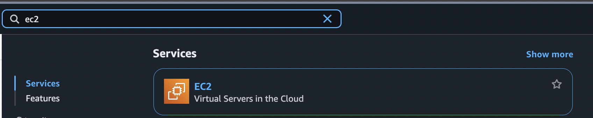
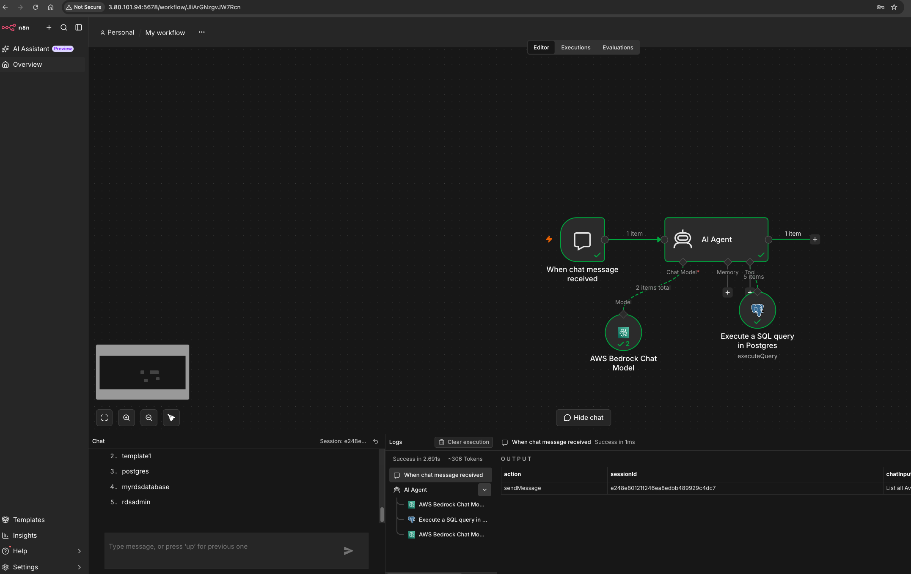

# postgres-db-management-aws-bedrock-agent-n8n-workflow

## Execution Steps:
### Task 1: Sign in to AWS Management Console

1. Click on the **Open Console** button, and we will get redirected to AWS Console in a new browser tab.

2. On the AWS sign-in page,

    • Leave the **Account ID** as default. Let the 12 digit Account ID present in the AWS Console. 

    • Now copy our User Name and Password in the Console to the **IAM Username** and **Password** in AWS Console and click on the **Sign in** button.

3. Once Signed In to the AWS Management Console, Make the default AWS Region as **US East (N. Virginia) us-east-1**.

### Task 2: Create & Configure an RDS PostgreSQL Database with Security Group

1. In the AWS Console search bar, type **EC2**. Select **EC2** from the results.

<p align="center">
  
</p>

2. Go to the EC2 Service portal, Under Network & Security, Click **Security Groups** in the left-hand panel, then click **Create Security Group**.
<p align="center">
  
</p>

3. Enter the name as **RDS_sg** and Description as **Creating RDS Security Group**, and select the **default VPC**.
<p align="center">
  
</p>

4. Under Inbound rules, Click **Add Rule** and do the following,
```
    • For SSH
        • Type: SSH
        • Port Range: 22
        • Source: Anywhere (0.0.0.0/0)

    • For PostgreSQL
        • Type: PostgreSQL
        • Port Range: 5432
        • Source: Anywhere (0.0.0.0/0)

    • For Custom TCP
        • Type: Custom TCP
        • Port Range: 5678
        • Source: Anywhere (0.0.0.0/0)
```

> Note: Port **5678** is used by **n8n**, a workflow automation tool, to run its web interface.


5. Click **Create Security Group**
<p align="center">
  
</p>


6. In the AWS Console search bar, type **RDS**. Select Aurora and RDS from the results.
<p align="center">
  
</p>

7. Click on **Databases** from the left navigation menu and then click **Create database**.
<p align="center">
  
</p>

8. In the Create Database section, specify the following details,

    • In the Database creation method: Choose **Standard create**

    • Engine options : Select **PostgreSQL**
    <p align="center">
    
    </p>

    • Version: **Default**

    • Template: Select **Free tier** or **sandbox**
    <p align="center">
    
    </p>

    • DB instance identifier : Enter **mydbinstance**

    • Master password and Confirm password: Enter **"YOUR_PASSWORD"**
    <p align="center">
    
    </p>

> Note: This is the username/password combo used to log onto our database. Please make note of them somewhere safe.


9. DB instance class : Select Burstable classes (includes t classes) - db.t3.micro - 2 vCPUs, 1 GiB RAM
    <p align="center">
    
    </p>

    • Storage type : Select **General Purpose SSD (gp2)**

    • Allocated storage : Select **20 (default)**

    • In the **Additional Storage Configuration**, Enable storage autoscaling :  Uncheck
    <p align="center">
    
    </p>

    • Virtual Private Cloud(VPC) : Select **Default VPC**

    • Subnet group : Select **Default**

    • Public Access : Select **yes**

    • VPC Security groups : Select **Choose existing**

    • Existing VPC security group name : Remove the **default** security group and select **RDS_sg** from the dropdown list.
<p align="center">
    
    </p>

9. Scroll down to **Additional Configuratio**n options at last, Expand it,

    • Initial database name: Enter **myrdsdatabase**

    • DB parameter group: Select **default**
    <p align="center">
    
    </p>

    • Option group: Select **default**

    • Enable automated backups: **Uncheck**

    • Enable encryption: **Uncheck**

    • Enable auto minor version upgrade: **Uncheck**

    • Maintenance window: Select **No preference**

    • Enable deletion protection: **uncheck**
    <p align="center">
    
    </p>


10. Leave other parameters as default. Scroll to the bottom of the page, Click **Create database**.

11. It will take around 5 minutes for the database to become available. Once the status changes from **creating** to **available**, the database is ready.

12. Open **mydbinstance** and note down the **Endpoint of RDS** under **Connectivity and security**
> Example: mydbinstance.c81x4bxxayay.us-east-1.rds.amazonaws.com

<p align="center">

</p>


### Task 3: Launch an EC2 Instance
1. Ensure we are in the **US East (N. Virginia) us-east-1** Region to begin launching an EC2 instance in the Amazon cloud.

2. Navigate to **EC2** by clicking on the Services menu in the top, then click on EC2 in the **Compute** section.

3. Click on the **Instances** option on the left panel, and then click on the **Launch Instances** button.
<p align="center">

</p>


4. Name: Enter **Ec-n8n-Server**
<p align="center">

</p>


5. Select **Amazon Linux 2023 AMI** from the dropdown.
<p align="center">

</p>

> Note: if there are two AMI's present for Amazon Linux 2o23 kernel-6.1 AMI.

6. An instance type in AWS refers to a virtual server configuration that determines the computing resources, such as CPU, memory, and storage, available to an instance. It is the basic building block for creating an EC2 instance in the AWS cloud.

For Instance Type: Select **t3.small** or **t3.medium** (preferred for better memory management)
<p align="center">

</p>

> Note: t3.micro is an instance type in AWS that comes with 2 vCPU, and 1GB memory and is suitable for low-traffic web servers, small development environments, and other lightweight applications but for better efficiency and no hiccups, we may also consider other higher instances

7. AWS key pair is a secure pair of keys used for login and access to EC2 instances. It includes a public key placed on the instance and a private key kept on the user's local computer, used for authentication to prevent unauthorized access.

    • For **Key pair (login)**: Select **Create a new key pair** Button

    • Key pair name: **YOUR_KEY_NAME**

     • Key pair type: **RSA**

     • Private key file format: **.pem**
    <p align="center">
    
    </p>


8. In Network Settings, Click on **Edit** Button:

    • Select existing security group

    • Common security groups: **RDS_sg**
    <p align="center">
    
    </p>

9. Leave everything as default, then click the **Launch Instance** button.


### Task 4: Deploy n8n via Docker

1. Now, Click on the Instance, Click on **Connect**.
    <p align="center">
    
    </p>

2. In the EC2 Instance Connect, Click on **Connect** button at the bottom
    <p align="center">
    
    </p>


3. Update the EC2 Instance

    • Ensure the system’s package index and installed packages are up-to-date to avoid compatibility issues and apply the latest security patches. 
    
    • Run the Below commands

```sh
sudo su
sudo dnf update –y
```
<p align="center">
    
    </p>


3. Install the Docker engine to run containerized applications like n8n.
```sh
sudo dnf install docker -y
```

4. Ensure the Docker service is running and configured to start automatically on system boot.
```sh
sudo systemctl start docker
sudo systemctl enable docker
```


5. Check if the Docker service is running. Look for active (running) in the output.
```sh
sudo systemctl status docker
```
<p align="center">
    
    </p>

6. Click Ctrl+C, Now, Download the official n8n Docker image from Docker Hub to run the n8n workflow automation tool.
```sh
docker pull n8nio/n8n
```
<p align="center">
    
    </p>

7. Start the n8n container with the specified configuration, making it accessible via HTTP on port 5678.
```sh
sudo docker run -d \
  --name n8n \
  -p 5678:5678 \
  -e N8N_PROTOCOL=http \
  -e N8N_HOST=localhost \
  -e N8N_PORT=5678 \
  -e N8N_SECURE_COOKIE=false \
  -v n8n_data:/home/node/.n8n \
  n8nio/n8n
```
<p align="center">
    
    </p>


8. Copy the **EC2 n8n server's public IP address** and open it in a web browser.

Type the following in the address bar: **http://<EC2-n8n-server-public-ip>:5678**
> Replace **<EC2-n8n-server-public-ip>** with the actual public IP of your EC2 instance.

9. We will get one web page.


### Task 5: Configure n8n workflow with nodes and connections

1. Enter your **email, first name, last name** and **password**  (8+ characters, with at least 1 number and 1 capital letter). Click **Next**.
<p align="center">
    
    </p>

2. Click **Get Started**
<p align="center">
    
    </p>

3. In the **Get paid features for free (forever)** prompt, click **Skip**.
<p align="center">
    
    </p>

4. Click **Start** from **Scratch** option.
<p align="center">
    
    </p>

5. Click the **plus icon** on the right side, then type **Chat Trigger** and select it. Press **Esc** key.
<p align="center">
    
    </p>
<p align="center">
    
    </p>

6. Next, click the **plus icon**, type **AI Agent** and select it to add the AI Agent node.
<p align="center">
    
    </p>

7. In the AI Agent node options section, click **Add Option** and choose **System Message**.
<p align="center">
    
    </p>

8. Delete the default message and Paste the following and go **Back to Canvas**
```sh
You are a database assistant. Your job is to convert user questions and requests into correct SQL queries for PostgreSQL. Generate precise SQL statements based on what the user asks for, whether it's retrieving data, creating tables, inserting records, or any other database operation.
```
<p align="center">
    
    </p>

9. Within the AI Agent node, locate the plus icon beside Chat Model. Click on it, type **AWS Bedrock**, and select the option.
<p align="center">
    
    </p>

10. Click the **Credential to connect with** field in the parameter section and choose the **Create new Credential**
<p align="center">
    
    </p>

11. Copy the access key and secret key from our portal and paste them. Click **Save** Button
<p align="center">
    
    </p>

12. In the model section, select the **Nova Lite** Model.
<p align="center">
    
    </p>


13. Click Esc Button or go Back to canvas.

14. Click the plus icon in the AI Agent Tool section to add the **Postgres Tool**.
<p align="center">
    
    </p>

15. In the Credentials to connect field, click **Create New Credentials**.
<p align="center">
    
    </p>

16. Replace the host section with the RDS endpoint for the previously created RDS database, enter the password **"YOUR_PASSWORD"**, and check the toggle button **'Ignore SSL Issues (Insecure)'**
<p align="center">
    
    </p>

17. Click **Save** button.
<p align="center">
    
    </p>

18. In the operation field, select 'Execute Query', and in the Query section, Paste the command 
```sh
{{ $fromAI('sql_statement') }}
```
<p align="center">
    
    </p>

&emsp;&emsp; • Press Esc Button 

19. Click **Open chat** button 
<p align="center">
    
    </p>

20. Run the Command 

    • Create a new database named EmployeeDB.
    
    • List all Available Databases

> Note: If we encounter any error, remove or replace the AI agent, System Massage 

<p align="center">
    
    </p>


### Conclusion:
• Successfully created an Amazon RDS PostgreSQL database.

• Successfully launched an EC2 instance and deployed n8n via Docker.

• Successfully configured an n8n workflow with Chat Trigger, AI Agent, and PostgreSQL nodes integrated with Amazon Bedrock's Nova Lite model.

• Successfully executed SQL queries to create a database and tables, and inserted sample data using the n8n chat interface.

<p align="center">
    
    </p>


